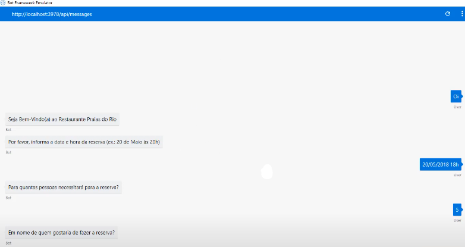

# CHATBOT DE RESTAURANTE
👨‍🏫PROJETO CRIADO PARA O CURSO DE MICROSOFT BOT FRAMEWORK.

 <br>

## DESCRIÇÃO:
Este bot construído com o framework BotBuilder para Node.js e Restify tem a finalidade de gerenciar reservas para um restaurante fictício chamado "Restaurante Praias do Rio". 

Este bot é um exemplo básico de como criar um assistente virtual para gerenciar reservas, utilizando prompts para coletar informações do usuário e responder de acordo com as interações.

## FUNCIONALIDADES:
1. **Bem-Vindo e Início da Reserva:**
   - Ao iniciar uma conversa com o bot, ele cumprimenta o usuário e solicita a data e hora desejadas para a reserva.

2. **Coleta de Informações:**
   - Após receber a data e hora da reserva, o bot solicita ao usuário o número de pessoas para a reserva e o nome para a qual será feita.

3. **Confirmação da Reserva:**
   - Após coletar todas as informações necessárias (data e hora da reserva, quantidade de pessoas e nome da reserva), o bot confirma os detalhes da reserva.

## EXECUTANDO O PROJETO:   
1. **Instalando as Depêndencias:**
   - Para instalar as dependências listadas no arquivo "package.json", você pode usar o comando `npm install` no terminal. Certifique-se de estar no diretório do seu projeto onde o arquivo "package.json" está localizado (`CODIGO`). O npm irá ler o arquivo "package.json" e instalar todas as dependências listadas nele. 

   ```bash
   npm install
   ```

2. **Inicie o Bot:**
   - Para usar o `NODE`, inicie o bot com o seguinte comando:
    ```bash
    npm start
    ```

    - Para usar o `NODEMON`, inicie o bot com o seguinte comando:
    ```bash
    npm test
    ```

3. **Usar o Emulador:**
   - Abra o Bot Framework Emulator.
   - No campo de endereço (Address), insira `http://localhost:3978/api/messages`.
   - No Emulador Bot Framework, clique no botão "Connect" para estabelecer a conexão com o bot.
   - Agora você pode começar a interagir com o bot através do emulador. Por exemplo:

     - **Usuário:** "Olá"
       - **Bot:** "Seja Bem-Vindo(a) ao Restaurante Praias do Rio. Por favor, informe a data e hora da reserva (ex.: 20 de Maio às 20h)."

     - **Usuário:** "20 de Julho às 19h"
       - **Bot:** "Para quantas pessoas necessitará para a reserva?"

     - **Usuário:** "Para 4 pessoas."
       - **Bot:** "Em nome de quem gostaria de fazer a reserva?"

     - **Usuário:** "Em nome de João."
       - **Bot:** "Reserva Confirmada. Seguem os detalhes da Reserva:
         - Dia/Hora: **20 de Julho às 19h**
         - Quantidade de Pessoas: **4**
         - Nome da Reserva: **João**"

4. **Usar o Terminal:**
   - Abra outro terminal.
   - Use `curl` ou outra ferramenta de requisições HTTP para enviar mensagens para o bot. Por exemplo:

   ```
   curl -X POST http://localhost:3978/api/messages -H "Content-Type: application/json" -d '{"type": "message", "text": "Olá"}'
   ```

   Isso enviará a mensagem "Olá" para o bot e você receberá as respostas conforme programado no código do bot.

## NÃO SABE?
- Entendemos que para manipular arquivos em muitas linguagens e tecnologias relacionadas, é necessário possuir conhecimento nessas áreas. Para auxiliar nesse aprendizado, oferecemos cursos gratuitos disponíveis:
* [CURSO DE JAVASCRIPT](https://github.com/VILHALVA/CURSO-DE-JAVASCRIPT)
* [CURSO DE NODEJS](https://github.com/VILHALVA/CURSO-DE-NODEJS)
* [CONFIRA MAIS CURSOS](https://github.com/VILHALVA?tab=repositories&q=+topic:CURSO)

## CREDITOS:
- [PROJETO CRIADO PARA O CURSO DE MICROSOFT BOT FRAMEWORK](https://github.com/VILHALVA/CURSO-DE-MICROSOFT-BOT-FRAMEWORK)
- [PROJETO FEITO PELO VILHALVA](https://github.com/VILHALVA)

